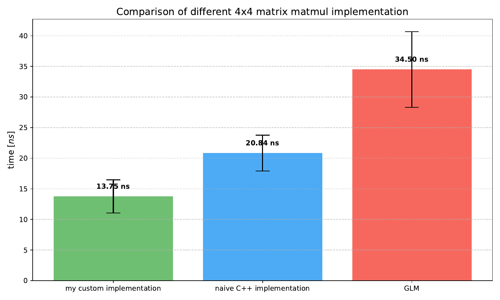

# benchmarks

## matmul

To evaluate the performance of my 4x4 matrix multiplication implementation, a series of runtime experiments was conducted. A total of 1,000,000 pairs of random 4x4 matrices were generated. The execution time of the 4x4 matrix multiplication was measured for three approaches: my optimized implementation utilizing SIMD instructions and memory alignment, a naïve C++ implementation, and the implementation provided by the GLM library. Each experiment was repeated ten times, and the mean execution time and standard deviation were computed across repetitions. The results are presented in the figure below.

