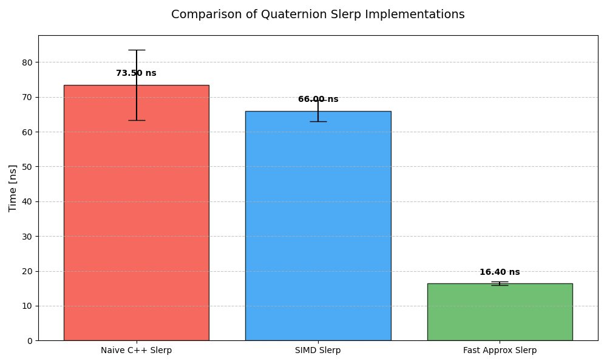

# benchmarks

## matmul

To evaluate the performance of my 4x4 matrix multiplication implementation, a series of runtime experiments was conducted. A total of 1,000,000 pairs of random 4x4 matrices were generated. The execution time of the 4x4 matrix multiplication was measured for three approaches: my optimized implementation utilizing SIMD instructions and memory alignment, a naive C++ implementation, and the implementation provided by the GLM library. Each experiment was repeated ten times, and the mean execution time and standard deviation were computed across repetitions. The results are presented in the figure below.

The performance difference observed for GLM may be caused by abstraction overhead, data layout, or conservative optimization choices aimed at portability. A deeper low-level analysis would be needed to pinpoint the exact reason. If anyone has insight into why GLM performs better than the naive implementation in this benchmark, feedback is very welcome.

## quaternion slerp

To evaluate the performance of various SLERP methods, three distinct approaches were compared: a naive scalar implementation, a version utilizing SIMD instructions, and a fast SLERP approximation based on a modified NLERP technique (as described in thttps://zeux.io/2015/07/23/approximating-slerp/). The benchmarks were conducted using 1000000 pairs of quaternions with randomized interpolation factors t. The results are presented in the figure below.

The results indicate that the SIMD-optimized SLERP provides only a marginal performance gain over the classical scalar implementation. This limited improvement is likely due to the overhead of trigonometric functions, which require scalar execution.

In contrast, the fast approximation implementation significantly outperforms both the precise scalar and SIMD versions, by replacing expensive trigonometric calls with purely vectorial arithmetic. Although the approximation is less precise than standard SLERP, the maximum angular error is not exceeding 1e-3f radians for a worst case 180° rotation. The maximum angular error is minor enoguh to use this implementation in my code.
